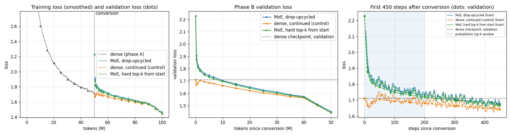
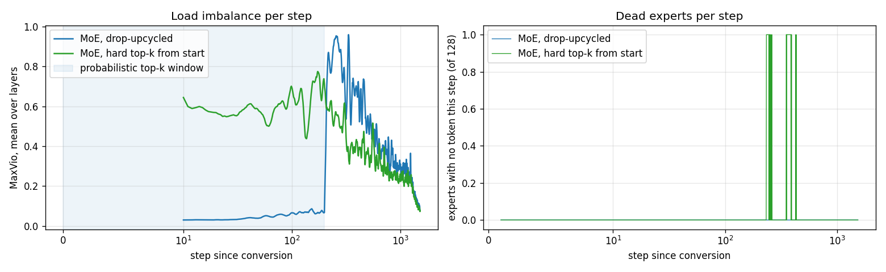
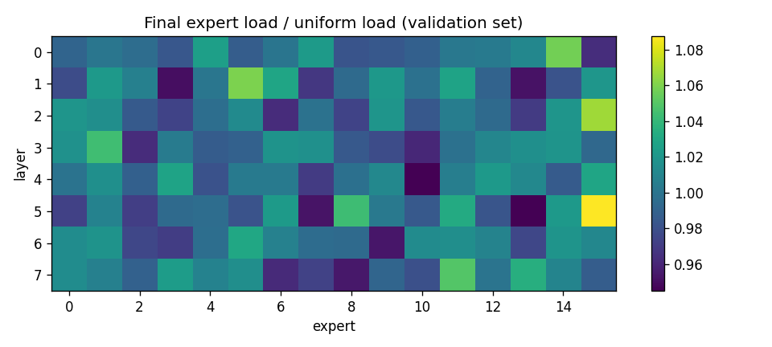
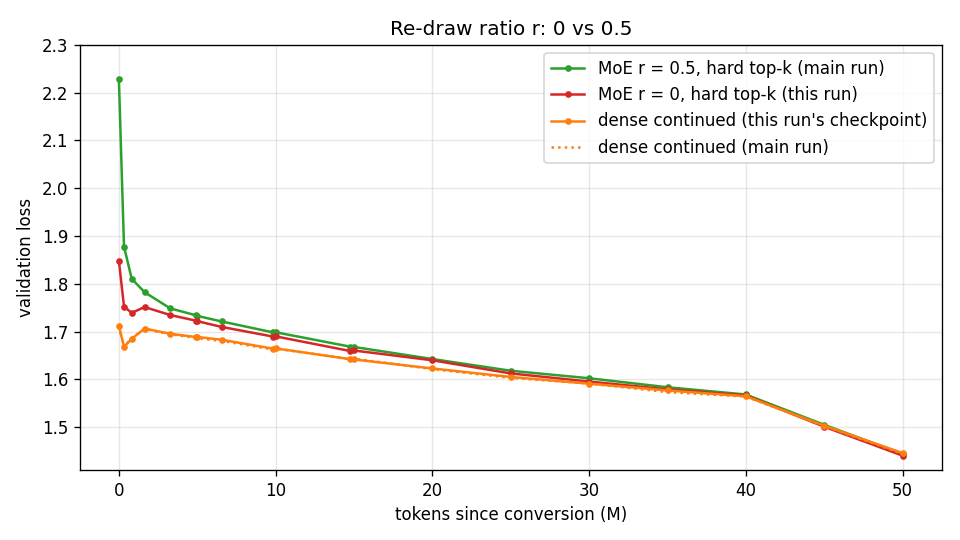

# Growing a dense GPT into a Mixture-of-Experts

ERA V5, Session 14. **Assignment:** train a dense ("linear") model, convert it into a
mixture-of-experts model, and show that the MoE keeps training and its loss keeps dropping.

Everything below was measured on one **Tesla T4** (fp16 autocast, router in fp32) in a single
top-to-bottom run of [`S14.ipynb`](S14.ipynb). Every number in this README is filled in from
[`results.json`](results.json), which that run wrote. **Training logs**, one JSON line per step
and per evaluation for every run, are in [`logs/`](logs/). The full notebook output is in
[`logs/nbexec.log`](logs/nbexec.log).

## Result

**Yes, the converted model keeps training.**
- Right after conversion the MoE's validation loss is 2.2278. The
  conversion itself costs +0.516; see below for why.
- It is back below the dense checkpoint's 1.7119 within
  9.8M tokens.
- It ends at **1.4523**: 0.776 below where it
  started, and -0.260 relative to the dense checkpoint.
- It has **0 dead experts** on the validation set.

**It does not beat simply training the dense model for the same 50M tokens.**
- The control ends at 1.4445.
- The drop-upcycled MoE finishes +0.0078 behind it. The hard-top-k
  variant finishes level, at -0.0008.
- The MoE learned faster per token once it had recovered: the gap closed steadily, from
  +0.516 at conversion to +0.0078 at the end. But
  it started from a handicap that 50M tokens did not quite erase.
- On this implementation it also costs **45,531 vs 97,017 tokens/s**
  of wall-clock throughput.



| run (phase B, +50,003,968 tokens each) | val loss at start | val loss at end | vs dense checkpoint (1.7119) | vs control | tokens/s | peak memory |
| --- | ---: | ---: | ---: | ---: | ---: | ---: |
| **MoE, drop-upcycled** | 2.2278 | **1.4523** | -0.2596 | **+0.0078** | 45,531 | 11.43 GiB |
| dense, continued (control) | 1.7119 | 1.4445 | -0.2674 | — | 97,017 | 6.70 GiB |
| MoE, hard top-k from start (ablation) | 2.2278 | 1.4437 | -0.2682 | -0.0008 | 45,580 | 11.43 GiB |

Phase A, the dense model: validation loss 9.106 → **1.7119**
over 50,003,968 tokens, at 97,323 tokens/s.

## What was built

**Data.** TinyStories V2 (GPT-4 split), the 8,192-token BPE from Session 13, and 512-token
windows in one fixed shuffled order. Phase A reads the first 50,003,968 tokens
of that order. Every phase-B run reads the *next* 50,003,968, so the MoE, the
control and the ablation see identical batches. Validation uses 524,288
held-out tokens.

**The dense model** (17.54M parameters): a GPT with width 384,
8 layers, 6 heads and context 512. It uses tied embeddings and a
GELU feed-forward block of hidden width 1536.

**The MoE layer** replaces each feed-forward block. It follows the lesson's layer (§3), router
(§7) and balancing (§13–14):

```
x ─┬─► shared expert (width 768) ─────────────────────────────────────┐
   │                                                                                      ├─► sum + b ─► y
   └─► router (fp32 softmax over 16) ─► top-4 of (probs + bias) ─► 4 × expert (width 192) × g_i ─┘
                         g_i = renormalised probs × 4 (routed scaling factor)
```

- **Width per token matches dense.** A token passes through 768 + 4 × 192 = 1536
  hidden units, the same as the dense block (lesson §4).
  - Active feed-forward parameters per layer: 1,187,712. This is
    the dense 1,181,568 plus the router.
  - Stored feed-forward parameters per layer: 2,959,488, which is
    **2.50×** the dense block.
  - Whole model: **31.76M total, 17.59M active per token.**
- **Router:** float32 (§7), initialised at one tenth of the usual scale.
- **Balancing:** auxiliary-loss-free, with a per-expert bias used only to choose and updated
  after each step by γ·sign(mean load − load_i), γ = 0.001, counted over the whole
  batch (§13–14). There is no auxiliary loss.
- **No token dropping** (§11).
- **Probabilistic top-k** (Gumbel sampling in proportion to probs + bias) for the first
  200 steps after conversion, then hard top-k (§15).

**The conversion** (`dense_to_moe`). A neuron of the dense block (a row of W1, an entry of b1, a
column of W2) is a one-unit MLP, and the block is the sum of its neurons. So:
- The **shared expert** is the first 768 neurons, unchanged.
- **Each routed expert** takes 192 neurons sampled at random from the other
  768, independently per expert. With 4 experts per token and the
  scaling factor 4, each of those neurons is used once per token in expectation, so
  the routed sum starts as an unbiased estimate of the dense half it replaces. This is the
  partition step of the lesson's Lightning LM recipe.
- **Drop-upcycling** (Nakamura et al., [arXiv 2502.19261](https://arxiv.org/abs/2502.19261)):
  - In each routed expert, r = 0.5 of its neurons are re-drawn.
  - Their W1 rows, b1 entries and W2 columns come from normal distributions with the mean and
    standard deviation of the original values at those neurons (the paper's §3.2 eq. 4, and
    its appendix C.6.1 for fine-grained experts).
  - This breaks the symmetry between experts that start from the same weights.

## Checked before anything trained

These are assertions in the notebook, and a failure stops the run:

| gate | what must hold | measured |
| --- | --- | --- |
| 1. copy upcycling | every expert a full copy of the dense block, top-2, weights summing to 1: output equals dense, whatever the router picks | max \|Δ\| = 1.8e-15 (float64) |
| 2. shared + partition | shared half + the other half cut into disjoint experts, all selected, scale k: output equals dense | max \|Δ\| = 1.1e-14 (float64) |
| 3. balancing | the sign rule on a router skewed ~20× toward one expert drives MaxVio down | 1.90 → 0.09 |
| 4. parameter count | active FFN = dense FFN + router exactly; total ≈ 2.5× | 1,187,712 = 1,181,568 + 384×16; 2.50× |

## The conversion, measured on the trained checkpoint

| version of the phase-A checkpoint | val loss | Δ vs dense |
| --- | ---: | ---: |
| dense | 1.7119 | — |
| copy upcycling (2 full copies, top-2): must match | 1.7119 | +0.0000 |
| shared + 16 sampled experts, r = 0 | 1.8553 | +0.1434 |
| **shared + 16 sampled experts, r = 0.5 (phase B starts here)** | **2.2278** | **+0.5160** |

- **The copy check confirms the conversion code on the real weights.** Two full copies with
  weights summing to one give the dense loss to 1.5e-07, which is
  float16 rounding.
- **Routing alone costs +0.143.** With nothing re-drawn, each token sees
  the shared half plus 4 of the 16 random slices of the other half. That is an unbiased but
  noisy estimate of the dense block.
- **Re-drawing half of every routed expert raises the jump from +0.143 to
  +0.516.** This is the price drop-upcycling
  pays on purpose: the re-drawn neurons are what make experts built from the same dense weights
  start out different. The shared expert is untouched, which is why the model is still far
  better than random (a fresh model starts at 9.11).

## Expert load





- **Balancing works.** At the end of both MoE runs the load on the validation set is close to
  uniform in every layer. Mean MaxVio over layers is 0.053
  (drop-upcycled) and 0.048 (hard top-k), meaning the
  busiest expert carries about 5% more than its fair share.
- **No expert died.** No expert received zero validation tokens in either run, at any
  evaluation.
  - Per training step, the drop-upcycled run never had an expert with no token (maximum
    0 of 128).
  - The hard-top-k run briefly had at most 1 of 128 during its
    first few hundred steps, and none over its last 100.
- **The probabilistic window changes the picture, and not for the better.** While experts are
  *sampled* in proportion to the router's probabilities, load is spread almost evenly by
  construction, so MaxVio sits near zero (left panel). The balancing bias therefore has nothing
  to correct and stays near zero too. When hard top-k switches on at step 200,
  the router's actual preferences appear all at once. That is the largest imbalance of either
  run, and the bias then needs a few hundred steps to catch up. The run that used hard top-k
  from the first step had moderate imbalance early and balanced steadily.

## Findings

1. **The assignment's two requirements are met.**
   - The MoE **continues to train**: no divergence, no dead experts, loss falling at every
     evaluation after the first.
   - Its **loss drops**: 2.2278 → 1.4523, ending
     -0.260 below the dense model it was grown from.

2. **Against a fair control, it ties rather than wins at this budget.** Validation loss at
   matched tokens after conversion:

   | tokens after conversion | MoE (drop-upcycled) | MoE (hard top-k) | dense continued |
   | ---: | ---: | ---: | ---: |
   | 0 | 2.2278 | 2.2278 | 1.7119 |
   | 1,638,400 | 1.7951 | 1.7825 | 1.7058 |
   | 9,830,400 | 1.7054 | 1.6985 | 1.6627 |
   | 25,001,984 | 1.6280 | 1.6181 | 1.6032 |
   | 39,976,960 | 1.5752 | 1.5685 | 1.5642 |
   | 50,003,968 | **1.4523** | **1.4437** | **1.4445** |

   - The MoE gains ground at every evaluation: it has 2.5× the feed-forward capacity at the same
     active size.
   - But the closing slowed during the final learning-rate decay. **This run does not show
     whether the MoE would pull ahead with more tokens**, and this README does not claim it.
   - The lesson's sparse-upcycling result (the MoE beats continuing the dense model within
     10–60% extra budget) is for full-copy upcycling at far larger scale. It is not reproduced
     here. The gap it would have to overcome is the conversion handicap in finding 3.

3. **Most of the handicap is the re-draw.** Routing alone costs +0.143; the
   drop-upcycling re-draw at r = 0.5 brings it to +0.516. The
   paper chose r = 0.5 for long training runs, where expert diversity has time to pay off. At
   50M tokens on a 17M model, keeping more of the dense model's knowledge is plausibly worth
   more. The follow-up below tests exactly this with r = 0.

4. **Probabilistic top-k did not help, as predicted.** If anything it hurt, but the final difference is within about twice the seed noise (finding 6).
   - The prediction (§11 of the notebook, written before the run) was a *small* effect. The
     failure it guards against, where near-identical clones under hard top-k collapse, needs
     clones, and these experts are 16 different random draws with half their neurons re-drawn.
   - Measured: hard top-k from the start ended at 1.4437, against
     1.4523 with the sampling window, with no collapse (at most 1 empty expert of 128 on any
     step).
   - The cost of sampling showed up as the imbalance spike when it switched off (see
     *Expert load*). Sampling routes tokens to experts the hard router would not choose, so
     those experts spend 200 steps training on assignments they will not get afterwards.

5. **Sparse compute is not free wall-clock time here.**
   - Throughput: 45,531 tokens/s for the MoE against
     97,017 for dense, at the same active parameters
     (17.59M vs 17.54M).
   - Peak memory: 11.43 vs 6.70 GiB.
   - The expert computation is a Python loop over 16 experts with gather and scatter. Production
     MoE code uses grouped or block-sparse matrix multiplication, as MegaBlocks does, and the
     lesson's §16 is about exactly this. The "same compute" claim holds in FLOPs, not on this
     implementation's clock.

6. **Caveats.**
   - This is one seed. Session 13 measured seed-to-seed differences of 0.004–0.006 in final
     validation loss on a similar TinyStories setup, so the final differences between the three
     phase-B runs (all under 0.01) are **not resolved**. The earlier, larger gaps are.
   - Both phase-B arms restart with a fresh optimiser and a short re-warmup, which is why the
     control's loss also rises briefly after the switch. The comparison is between two runs
     that had the same restart.

## Follow-up: the same MoE with nothing re-drawn (r = 0)

[`S14_r0.ipynb`](S14_r0.ipynb) (39 min) tested finding 3 by changing only r,
from 0.5 to 0. It runs the main notebook's cells verbatim and uses hard top-k, so
it pairs with the main run's hard-top-k arm.
- It retrained the dense phase with the same seed. That reproduced the main run's dense loss
  to +0.0002.
- It reran the control from that checkpoint. The control reproduced to
  +0.0014, which measures run-to-run noise at a
  fixed seed.

The prediction, written in that notebook before the run: a smaller jump, a faster recovery,
and a lower final loss than r = 0.5. **All three held.**

| | r = 0 (follow-up) | r = 0.5, hard top-k (main) | dense continued (same checkpoint) |
| --- | ---: | ---: | ---: |
| conversion jump | +0.1360 | +0.5160 | — |
| tokens to get back below the dense checkpoint | 6.6M | 9.8M | — |
| final val loss | **1.4404** | 1.4437 | 1.4459 |
| vs the control | **-0.0055** | -0.0008 | — |



- Without the re-draw handicap, the MoE **overtakes the dense control**. It was behind at 40M
  tokens after conversion (1.5667 vs 1.5649)
  and ahead at 45M and 50M.
- The lead is small: -0.0055. That is well above the same-seed
  rerun noise measured here, but at the edge of the 0.004–0.006 seed-to-seed spread Session 13
  measured. So read it as "no longer behind, probably slightly ahead", not as a resolved win.
- At this scale and budget, keeping the dense model's knowledge (r = 0) beat drop-upcycling's
  diversity (r = 0.5). This is one setting and one seed, not a refutation of the paper, which
  targets much longer training.
- No dead experts: 0 on the validation set, and at most
  0 on any step. Final mean MaxVio was
  0.048.

## Cost

- Total notebook runtime: 58.8 min, about **$0.81**
  (g4dn.2xlarge, $0.828/h on-demand, ap-south-1).
- Tokens/s is steady-state: every step after the first 20, evaluation excluded, with a GPU sync
  before each clock read.
- Peak memory is `torch.cuda.max_memory_allocated()` over each run.

## Reproduce

```bash
pip install -r requirements.txt
python tools/py2nb.py notebook_src.py S14.ipynb     # the notebook is generated from notebook_src.py
python tools/run_nb.py S14.ipynb                     # executes top to bottom; any failing gate stops it
python tools/build_readme.py                         # README.md from README.tmpl.md + results.json
S14_SMOKE=1 python tools/run_nb.py S14.ipynb         # a 2-minute CPU dry run of the whole pipeline
```

| file | what it is |
| --- | --- |
| `notebook_src.py` | source of truth for the notebook |
| `S14.ipynb` | the executed notebook, with outputs from the T4 run |
| `notebook_r0_src.py` → `S14_r0.ipynb` | the r = 0 follow-up (executed on the T4), results under `r0` in `results.json` |
| `results.json` | every measured number, written by the notebook's last cell |
| `logs/train_<run>.jsonl` | per-step training log: loss, LR, grad norm, and for MoE runs per-layer MaxVio and dead-expert count; plus per-evaluation validation loss and full per-layer expert load |
| `logs/progress.txt` | the evaluation lines as they were printed during the run |
| `logs/nbexec.log` | every cell's printed output |
| `assets/` | plots, and the tokenizer |

## References

Lesson: *ERA V5 Session 14, Mixture-of-Experts* (The School of AI), §3, §7, §11, §13–15.
arXiv IDs were checked against arxiv.org.

- Nakamura et al., *Drop-Upcycling: Training Sparse Mixture of Experts with Partial
  Re-initialization*, [arXiv 2502.19261](https://arxiv.org/abs/2502.19261) (2025).
- Komatsuzaki et al., *Sparse Upcycling: Training Mixture-of-Experts from Dense Checkpoints*,
  [arXiv 2212.05055](https://arxiv.org/abs/2212.05055) (2022).
- Wang et al., *Auxiliary-Loss-Free Load Balancing Strategy for Mixture-of-Experts*,
  [arXiv 2408.15664](https://arxiv.org/abs/2408.15664) (2024).
- Qiu et al., *Demons in the Detail: On Implementing Load Balancing Loss for Training
  Specialized Mixture-of-Expert Models*, [arXiv 2501.11873](https://arxiv.org/abs/2501.11873)
  (2025), on whole-batch balancing.
- Fedus et al., *Switch Transformers*, [arXiv 2101.03961](https://arxiv.org/abs/2101.03961)
  (2021), on the fp32 router and small router init.
- Dai et al., *DeepSeekMoE*, [arXiv 2401.06066](https://arxiv.org/abs/2401.06066) (2024), on
  fine-grained and shared experts.
- Gale et al., *MegaBlocks*, [arXiv 2211.15841](https://arxiv.org/abs/2211.15841) (2022), on
  dropless MoE.
- Eldan & Li, *TinyStories*, [arXiv 2305.07759](https://arxiv.org/abs/2305.07759) (2023).
